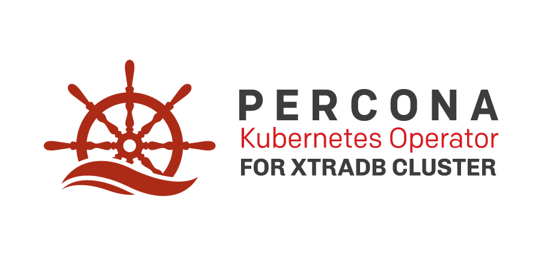

[Percona XtraDB Cluster](https://www.percona.com/software/mysql-database/percona-xtradb-cluster) (PXC) is an open-source enterprise MySQL solution that helps you to ensure data availability for your applications while improving security and simplifying the development of new applications in the most demanding public, private, and hybrid cloud environments.

Based on our best practices for deployment and configuration, [Percona Kubernetes Operator for PXC](https://www.percona.com/doc/kubernetes-operator-for-pxc/index.html) contains everything you need to quickly and consistently deploy and scale Percona XtraDB Cluster instances in a Kubernetes-based environment on-premises or in the cloud. It provides the following capabilities:

* Easy deployment with no single point of failure
* Load balancing and proxy service with either HA Proxy or ProxySQL
* Scheduled and manual backups
* Integrated monitoring with [Percona Monitoring and Management](https://www.percona.com/software/database-tools/percona-monitoring-and-management)
* Smart Update to keep your database software up to date automatically
* Automated Password Rotation – use the standard Kubernetes API to enforce password rotation policies for system user
* Private container image registries

# Architecture

Percona Operators are based on the [Operator SDK](https://github.com/operator-framework/operator-sdk) and leverage Kubernetes primitives to follow best CNCF practices. 

Please read more about architecture and design decisions [here](https://www.percona.com/doc/kubernetes-operator-for-pxc/architecture.html).

# Installation

It usually takes two steps to deploy Percona XtraDB Cluster on Kubernetes:

* Deploy the operator from `deploy/bundle.yaml`
* Deploy the database cluster itself from `deploy/cr.yaml`

See full documentation with examples and various advanced cases on [percona.com](https://www.percona.com/doc/kubernetes-operator-for-pxc/index.html).

# Contributing

Percona welcomes and encourages community contributions to help improve Percona Kubernetes Operator for Percona XtraDB Cluster.

See the [Contribution Guide](CONTRIBUTING.md) and [Building and Testing Guide](e2e-tests/README.md) for more information.

# Roadmap

We have an experimental public roadmap which can be found [here](https://github.com/percona/roadmap/projects/1). Please feel free to contribute and propose new features by following the roadmap [guidelines](https://github.com/percona/roadmap).
 
# Submitting Bug Reports

If you find a bug in Percona Docker Images or in one of the related projects, please submit a report to that project's [JIRA](https://jira.percona.com/browse/K8SPXC) issue tracker. Learn more about submitting bugs, new features ideas and improvements in the [Contribution Guide](CONTRIBUTING.md).

