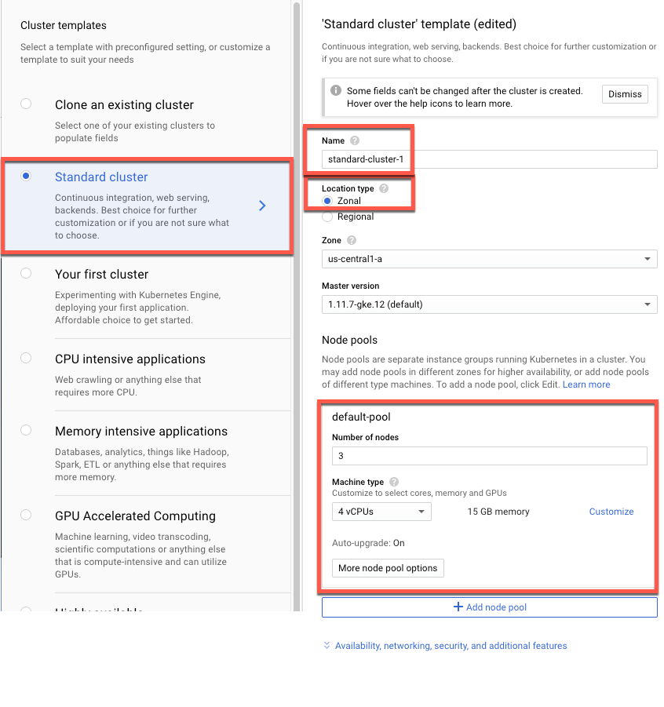

Quickstart for the Percona XtraDB Cluster Operator with the Google Kubernetes Engine (GKE)
==========================================================================================

This quickstart shows you how to configure a Percona XtraDB cluster
operator with the Google Kubernetes Engine. The document assumes some
experience with Google Kubernetes Engine (GKE). For more information on
the GKE, see the `Kubernetes Engine
Quickstart <https://cloud.google.com/kubernetes-engine/docs/quickstart>`__.

Prerequisites
-------------

This quickstart uses your local shell. You must install the following:
\* ```gcloud`` <https://cloud.google.com/sdk/docs/quickstarts>`__ The
Google Cloud SDK is the Cloud Platform toolset. \*
```kubectl`` <https://cloud.google.com/kubernetes-engine/docs/quickstart#choosing_a_shell>`__
the Kubernetes command-line tool. You can use the tool to manage and
deploy applications. Run the following command:

.. code:: bash

   gcloud components install kubectl

Configuring default settings for the cluster
--------------------------------------------

You can configure the settings in two ways:

|GKE console|\ {: .align-center}

A. In the GKE console, select Create Cluster.

In the Create a Kubernetes cluster window, in the sidebar, select
``Standard cluster``.

In the Standard cluster template, edit the following settings:

-  Name - Provide a descriptive name.

-  Location type - Select ``Zonal``.

-  Default-pool - the pool should have the following setting: Number of
   nodes: ``3`` Machine type: ``4 vCPUs`` ``15 GB memory``

Select ``Create`` to generate a Kubernetes cluster with the chosen
settings.

B. As an alternative, you can run a gcloud command in the `Cloud
Shell <https://cloud.google.com/shell/docs/quickstart>`__.

**Note** *You must edit the following command and other command line
statements to replace the ``<project name>`` placeholder with your
project name.*

::

  gcloud container clusters create standard-cluster-1 --project <project name> --zone us-central1-a --cluster-version 1.12 --machine-type n1-standard-4 --num-nodes=3

You may wait a few minutes for the cluster to be generated.

In the Google Cloud console, select your cluster and then select
``Connect``. The connect statement configures command line access. After
you have edited the statement, you may run the command in your local
shell or in the Cloud Shell.

For this document, we are using the local shell.

::

   gcloud container clusters get-credentials standard-cluster-1 --zone us-central1-a --project <project name>

Installing the Operator
-----------------------

1. Use the ``git clone`` command to download the correct branch of the
   percona-xtradb-cluster-operator repository.
   **Note:** *In the git statement, you must specify the correct branch
   with the -b option.*

.. code:: bash

       git clone -b release-0.3.0 https://github.com/percona/percona-xtradb-cluster-operator

After the repository is downloaded, change the directory to run the rest
of the commands in this document:

::

   cd percona-xtradb-cluster-operator

2. Extensions of the Kubernetes API are custom resources. The Custom
   Resource Definition for PXC adds the operator resources. This step is
   only run once. After the Kubernetes API has been extended any
   additional operator deployments use the same resources.

.. code:: bash

   kubectl apply -f deploy/crd.yaml

The following confirmation is returned:

::

         customresourcedefinition.apiextensions.k8s.io/perconaxtradbclusters.pxc.percona.com created
         customresourcedefinition.apiextensions.k8s.io/perconaxtradbbackups.pxc.percona.com created

3. Create a namespace. The resource names must be unique within the
   namespace and provide a way to divide cluster resources between users
   spread across multiple projects.
   You must replace the ``<namespace name>`` placeholder with a
   descriptive name.

.. code:: bash

   kubectl create namespace <namespace name>

The following confirmation is returned:

::

       namespace/<namespace name> created

4. Set the context for the namespace, which saves the namespace for
   subsequent commands. You must replace the ``<namespace name>``
   placeholder with the name used in the earlier step.

.. code:: bash

   kubectl config set-context $(kubectl config current-context) --namespace=<namespace name>

A successful return statement prints the project name, location (for
this example, a zone), and cluster name.

.. code:: bash

   Context "<project name>_<zone location>_<cluster name>" modified.

5. You use Cloud Identity and Access Management (Cloud IAM) to control
   access to the cluster. You must have the ability to create Roles and
   RoleBindings. In the following command, you must replace the email
   address placeholder with your email address.

.. code:: bash

   kubectl create clusterrolebinding cluster-admin-binding \
   --clusterrole=cluster-admin --user=$(gcloud config get-value core/account)

The return statement confirms the creation.

.. code:: bash

   clusterrolebinding.rbac.authorization.k8s.io/cluster-admin-binding created

6. The role-based access control (RBAC) for the cluster should be
   configured from the deploy/rbac.yaml file.

.. code:: bash

   kubectl apply -f deploy/rbac.yaml

The return statement confirms the appropriate roles have been created.

.. code:: bash

   role.rbac.authorization.k8s.io/percona-xtradb-cluster-operator created
   rolebinding.rbac.authorization.k8s.io/default-account-percona-xtradb-cluster-operator created

7. The following file starts the operator within the cluster:

.. code:: bash

   kubectl apply -f deploy/operator.yaml

The return statement confirms the creation of the operator.

.. code:: bash

   deployment.apps/percona-xtradb-cluster-operator created

8. The data section of the deploy/secrets.yaml file contains
   base64-encoded logins and passwords for the user accounts.

.. code:: bash

   kubectl apply -f deploy/secrets.yaml

The return statement confirms the creation.

.. code:: bash

   secret/my-cluster-secrets created

9. The operator has been started and the user secrets have been added,
   you can create the Percona XtraDB cluster.

.. code:: bash

   kubectl apply -f deploy/cr.yaml

The process could take some time. The return statement confirms the
creation:

.. code:: bash

   perconaxtradbcluster.pxc.percona.com/cluster1 created

Verifying the cluster operator
------------------------------

To verify the cluster creation, run the following command:

.. code:: bash

   kubectl get pods

The return statement lists the pods and their current state.

.. code:: bash

   NAME                                               READY     STATUS    RESTARTS   AGE
   cluster1-proxysql-0                                3/3       Running   0          9m
   cluster1-pxc-0                                     1/1       Running   0          9m
   cluster1-pxc-1                                     1/1       Running   0          8m
   cluster1-pxc-2                                     1/1       Running   0          6m
   percona-xtradb-cluster-operator-75dbc8b64d-pz7xq   1/1       Running   0          19m

To connect to the cluster, run the following command:

.. code:: bash

   kubectl run -i --rm --tty percona-client --image=percona:5.7 --restart=Never -- bash -il

The return statement opens a ``bash`` command prompt:

::

   If you don't see a command prompt, try pressing enter.
   $

At the command prompt, connect to the MySQL server host.

.. code:: bash

   mysql -h cluster1-proxysql -uroot -proot_password

The return statements connects to the MySQL monitor.

.. code:: bash

   mysql: [Warning] Using a password on the command line interface can be insecure.
   Welcome to the MySQL monitor.  Commands end with ; or \g.
   Your MySQL connection id is 111
   Server version: 5.5.30 (ProxySQL)

   Copyright (c) 2009-2019 Percona LLC and/or its affiliates
   Copyright (c) 2000, 2019, Oracle and/or its affiliates. All rights reserved.

   Oracle is a registered trademark of Oracle Corporation and/or its
   affiliates. Other names may be trademarks of their respective
   owners.

   Type 'help;' or '\h' for help. Type '\c' to clear the current input statement.

At the MySQL prompt, you can check the ``max_connections`` variable.

.. code:: bash

   mysql> SHOW VARIABLES LIKE "max_connections";

The return statement displays the current max_connections.

.. code:: bash

   +-----------------+-------+
   | Variable_name   | Value |
   +-----------------+-------+
   | max_connections | 151   |
   +-----------------+-------+
   1 row in set (0.00 sec)

Troubleshooting
---------------

The phrases in the install/secrets.yaml can be decoded with the
following:

.. code:: bash

   $ echo -n `phrase` | base64 -D

If needed, use the ``kubectl describe`` command for the pod details. For
example, this command returns information for the selected pod:

.. code:: bash

   kubectl describe pod cluster1-pxc-0

Review the detailed information for ``Warning`` statements and then
correct the configuration. An example of a warning is as follows:

::

   Warning  FailedScheduling  68s (x4 over 2m22s)  default-scheduler  0/1 nodes are available: 1 node(s) didn't match pod affinity/anti-affinity, 1 node(s) didn't satisfy existing pods anti-affinity rules.

Removing the cluster
--------------------

There are several ways that you can delete the cluster.

A. You can clean up the cluster with the following command:

1. Delete your cluster by running the following:

::

   gcloud container clusters delete <cluster name>

The return statement requests your confirmation of the deletion. Type
``y`` to confirm.

B. Or in the GKE console, select your cluster and then select the
trashcan icon to delete the cluster.

The cluster deletion may take time.


