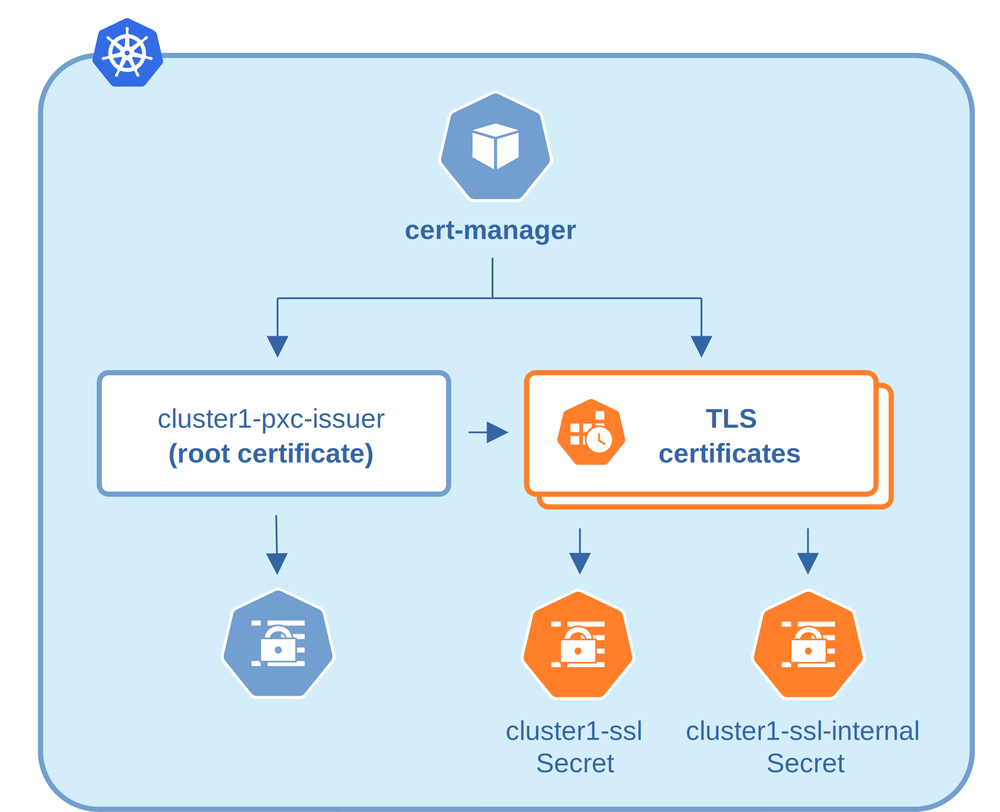

.. _tls:

Transport Layer Security (TLS)
******************************

The Percona Distribution for MySQL Operator uses Transport Layer
Security (TLS) cryptographic protocol for the following types of communication:

* Internal - communication between Percona XtraDB Cluster instances,
* External - communication between the client application and ProxySQL.

The internal certificate is also used as an authorization method.

TLS security can be configured in several ways. By default, the Operator
generates long-term certificates automatically if there are no certificate
secrets available. Other options are the following ones:

* The Operator can use a specifically installed *cert-manager*, which will
  automatically generate and renew short-term TLS certificates,
* Certificates can be generated manually.

You can also use pre-generated certificates available in the
``deploy/ssl-secrets.yaml`` file for test purposes, but we strongly recommend
avoiding their usage on any production system!

The following subsections explain how to configure TLS security with the
Operator yourself, as well as how to temporarily disable it if needed.

.. contents:: :local:

.. _tls.certs.certmanager:

Install and use the *cert-manager*
==================================

About the *cert-manager*
------------------------

A `cert-manager <https://cert-manager.io/docs/>`_ is a Kubernetes certificate
management controller which is widely used to automate the management and
issuance of TLS certificates. It is community-driven, and open source.

When you have already installed *cert-manager* and deploy the operator, the
operator requests a certificate from the *cert-manager*. The *cert-manager* acts
as a self-signed issuer and generates certificates. The Percona Operator
self-signed issuer is local to the operator namespace. This self-signed issuer
is created because Percona XtraDB Cluster requires all certificates issued
by the same :abbr:`CA (Certificate authority)`.

Self-signed issuer allows you to deploy and use the Percona
Operator without creating a clusterissuer separately.

Installation of the *cert-manager*
----------------------------------

The steps to install the *cert-manager* are the following:

* Create a namespace,
* Disable resource validations on the cert-manager namespace,
* Install the cert-manager.

The following commands perform all the needed actions:

.. code:: bash

   $ kubectl create namespace cert-manager
   $ kubectl label namespace cert-manager certmanager.k8s.io/disable-validation=true
   $ kubectl_bin apply -f https://github.com/jetstack/cert-manager/releases/download/v0.15.1/cert-manager.yaml

After the installation, you can verify the *cert-manager* by running the following command:

.. code:: bash

   $ kubectl get pods -n cert-manager

The result should display the *cert-manager* and webhook active and running.

.. _tls.certs.manual:

Generate certificates manually
==============================

To generate certificates manually, follow these steps:

1. Provision a Certificate Authority (CA) to generate TLS certificates

2. Generate a CA key and certificate file with the server details

3. Create the server TLS certificates using the CA keys, certs, and server
   details

The set of commands generate certificates with the following attributes:

*  ``Server-pem`` - Certificate

*  ``Server-key.pem`` - the private key

*  ``ca.pem`` - Certificate Authority

You should generate certificates twice: one set is for external communications,
and another set is for internal ones. A secret created for the external use must
be added to ``cr.yaml/spec/secretsName``. A certificate generated for internal
communications must be added to the ``cr.yaml/spec/sslInternalSecretName``.

.. code:: bash

   $ cat <<EOF | cfssl gencert -initca - | cfssljson -bare ca
   {
     "CN": "Root CA",
     "key": {
       "algo": "rsa",
       "size": 2048
     }
   }
   EOF

   $ cat <<EOF | cfssl gencert -ca=ca.pem  -ca-key=ca-key.pem - | cfssljson -bare server
   {
     "hosts": [
       "${CLUSTER_NAME}-proxysql",
       "*.${CLUSTER_NAME}-proxysql-unready",
       "*.${CLUSTER_NAME}-pxc"
     ],
     "CN": "${CLUSTER_NAME}-pxc",
     "key": {
       "algo": "rsa",
       "size": 2048
     }
   }
   EOF

   $ kubectl create secret generic my-cluster-ssl --from-file=tls.crt=server.pem --
   from-file=tls.key=server-key.pem --from-file=ca.crt=ca.pem --
   type=kubernetes.io/tls

.. _tls.certs.update:

Update certificates
===================

If a :ref:`cert-manager<tls.certs.certmanager>` is used, it should take care of
updating the certificates. If you :ref:`generate certificates manually<tls.certs.manual>`,
you are should take care of updating them in proper time.

TLS certificates issued by cert-manager are short-term ones. Starting from the
Operator version 1.9.0 cert-manager issues TLS certificates for 3 months, while
root certificate is valid for 3 years. This allows to reissue TLS certificates
automatically on schedule and without downtime.

.. _tls.certs.update.check.issuer:

Versions of the Operator prior 1.9.0 have used 3 month root certificate, which
caused issues with the automatic TLS certificates update. If that's your case,
you can make the Operator update along with the :ref:`official instruction<operator-update>`.

.. note:: If you use the cert-manager version earlier than 1.9.0, and you would
   like to avoid downtime while updating the certificates after the Operator
   update to 1.9.0 or newer version,
   :ref:`force the certificates regeneration by a cert-manager<tls.certs.update.with.downtime>`.

.. _tls.certs.update.check:

Check your certificates for expiration
--------------------------------------

#. First, check the necessary secrets names (``my-cluster-ssl`` and 
   ``my-cluster-ssl-internal`` by default):

   .. code:: bash

      $ kubectl get certificate

   You will have the following response:

   .. code:: text

      NAME                    READY   SECRET                    AGE
      cluster1-ssl            True    my-cluster-ssl            49m
      cluster1-ssl-internal   True    my-cluster-ssl-internal   49m

#. Optionally you can also check that the certificates issuer is up and running:

   .. code:: bash

      $ kubectl get issuer

   The response should be as follows:

   .. code:: text

      NAME              READY   AGE
      cluster1-pxc-ca   True    49m

#. Now use the following command to find out the certificates validity dates,
   substituting Secrets names if necessary:

   .. code:: bash

      $ {
        kubectl get secret/my-cluster-ssl-internal -o jsonpath='{.data.tls\.crt}' | base64 --decode | openssl x509 -inform pem -noout -text | grep "Not After"
        kubectl get secret/my-cluster-ssl -o jsonpath='{.data.ca\.crt}' | base64 --decode | openssl x509 -inform pem -noout -text | grep "Not After"
        }

   The resulting output will be self-explanatory:

   .. code:: text

      Not After : Sep 15 11:04:53 2021 GMT
      Not After : Sep 15 11:04:53 2021 GMT

.. _tls.certs.update.without.downtime:

Update certificates without downtime
------------------------------------

If you don't use :ref:`cert-manager<tls.certs.certmanager>` and have *created certificates manually*, 
you can follow the next steps to perform a no-downtime update of these
certificates *if they are still valid*.

.. note:: For already expired certificates, follow :ref:`the alternative way<tls.certs.update.with.downtime>`.

Having non-expired certificates, you can roll out new certificates (both CA and TLS) with the Operator
as follows.

#. Generate a new CA certificate (``ca.pem``). Optionally you can also generate
   a new TLS certificate and a key for it, but those can be generated later on
   step 6.

#. Get the current CA (``ca.pem.old``) and TLS (``tls.pem.old``) certificates
   and the TLS certificate key (``tls.key.old``):

   .. code:: bash

      $ kubectl get secret/my-cluster-ssl-internal -o jsonpath='{.data.ca\.crt}' | base64 --decode > ca.pem.old
      $ kubectl get secret/my-cluster-ssl-internal -o jsonpath='{.data.tls\.crt}' | base64 --decode > tls.pem.old
      $ kubectl get secret/my-cluster-ssl-internal -o jsonpath='{.data.tls\.key}' | base64 --decode > tls.key.old

#. Combine new and current ``ca.pem`` into a ``ca.pem.combined`` file:

   .. code:: bash

      $ cat ca.pem ca.pem.old >> ca.pem.combined
 
#. Create a new Secrets object with *old* TLS certificate (``tls.pem.old``)
   and key (``tls.key.old``), but a *new combined* ``ca.pem``
   (``ca.pem.combined``):

   .. code:: bash

      $ kubectl delete secret/my-cluster-ssl-internal
      $ kubectl create secret generic my-cluster-ssl-internal --from-file=tls.crt=tls.pem.old --from-file=tls.key=tls.key.old --from-file=ca.crt=ca.pem.combined --type=kubernetes.io/tls

#. The cluster will go through a rolling reconciliation, but it will do it
   without problems, as every node has old TLS certificate/key, and both new
   and old CA certificates.

#. If new TLS certificate and key weren't generated on step 1,
   :ref:`do that <tls.certs.manual>` now.

#. Create a new Secrets object for the second time: use new TLS certificate
   (``server.pem`` in the example) and its key (``server-key.pem``), and again
   the combined CA certificate (``ca.pem.combined``):

   .. code:: bash

      $ kubectl delete secret/my-cluster-ssl-internal
      $ kubectl create secret generic my-cluster-ssl-internal --from-file=tls.crt=server.pem --from-file=tls.key=server-key.pem --from-file=ca.crt=ca.pem.combined --type=kubernetes.io/tls

#. The cluster will go through a rolling reconciliation, but it will do it
   without problems, as every node already has a new CA certificate (as a part
   of the combined CA certificate), and can successfully allow joiners with new
   TLS certificate to join. Joiner node also has a combined CA certificate, so
   it can authenticate against older TLS certificate.

#. Create a final Secrets object: use new TLS certificate (``server.pmm``) and
   its key (``server-key.pem``), and just the new CA certificate (``ca.pem``):

   .. code:: bash

      $ kubectl delete secret/my-cluster-ssl-internal
      $ kubectl create secret generic my-cluster-ssl-internal --from-file=tls.crt=server.pem --from-file=tls.key=server-key.pem --from-file=ca.crt=ca.pem --type=kubernetes.io/tls

#. The cluster will go through a rolling reconciliation, but it will do it
   without problems: the old CA certificate is removed, and every node is
   already using new TLS certificate and no nodes rely on the old CA
   certificate any more.

.. _tls.certs.update.with.downtime:

Update certificates with downtime
---------------------------------

If your certificates have been already expired (or if you continue to use the
Operator version prior to 1.9.0), you should move through the
*pause - update Secrets - unpause* route as follows.

#. Pause the cluster :ref:`in a standard way<operator-pause>`, and make
   sure it has reached its paused state.

#. If :ref:`cert-manager<tls.certs.certmanager>` is used, delete issuer
   and TLS certificates:

   .. code:: bash

      $ {
        kubectl delete issuer/cluster1-pxc-ca
        kubectl delete certificate/cluster1-ssl certificate/cluster1-ssl-internal
        }

#. Delete Secrets to force the SSL reconciliation:

   .. code:: bash

      $ kubectl delete secret/my-cluster-ssl secret/my-cluster-ssl-internal

#. :ref:`Check certificates<tls.certs.update.check>` to make sure reconciliation
   have succeeded.

#. Unpause the cluster :ref:`in a standard way<operator-pause>`, and make
   sure it has reached its running state.

.. _tls.no.tls:

Run Percona XtraDB Cluster without TLS
======================================

Omitting TLS is also possible, but we recommend that you run your cluster with
the TLS protocol enabled. 

To disable TLS protocol (e.g. for demonstration purposes) edit the
``cr.yaml/spec/allowUnsafeConfigurations`` setting to ``true`` and make sure
that there are no certificate secrets available.
