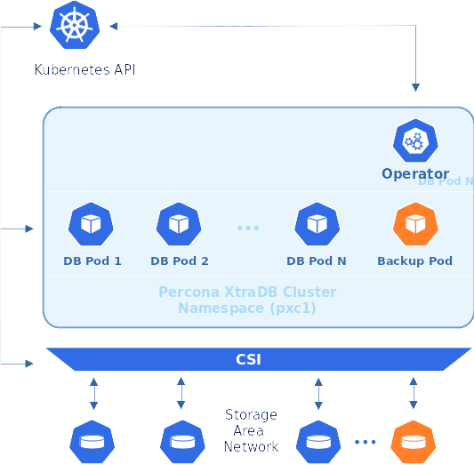

Providing Backups
=================

The Operator usually stores Percona XtraDB Cluster backups outside the
Kubernetes cluster, on `Amazon S3 or S3-compatible storage <https://en.wikipedia.org/wiki/Amazon_S3#S3_API_and_competing_services>`_,
or on `Azure Blob Storage <https://azure.microsoft.com/en-us/services/storage/blobs/>`_:

.. figure:: assets/images/backup-s3.png
   :align: center
   :alt: Backup on S3-compatible storage

But storing backups on `Persistent Volumes <https://kubernetes.io/docs/concepts/storage/persistent-volumes/>`_ inside the Kubernetes cluster is also possible:

The Operator allows doing backups in two ways.
*Scheduled backups* are configured in the
`deploy/cr.yaml <https://github.com/percona/percona-xtradb-cluster-operator/blob/main/deploy/cr.yaml>`__
file to be executed automatically in proper time. *On-demand backups*
can be done manually at any moment.

.. contents:: :local:

.. _backups.scheduled:

Making scheduled backups
------------------------

Backups schedule is defined in the ``backup`` section of the
`deploy/cr.yaml <https://github.com/percona/percona-xtradb-cluster-operator/blob/main/deploy/cr.yaml>`__
file. This section contains following subsections:

* ``storages`` subsection contains data and configuration needed to store backups.
* ``schedule`` subsection allows to actually schedule backups (the schedule is
  specified in crontab format).

.. _backups.scheduled-s3:

Backups on Amazon S3 or S3-compatible storage
*********************************************

Since backups are stored separately on the Amazon S3, a secret with
``AWS_ACCESS_KEY_ID`` and ``AWS_SECRET_ACCESS_KEY`` should be present on
the Kubernetes cluster. The secrets file with these base64-encoded keys should
be created: for example ``deploy/backup-s3.yaml`` file with the following
contents:

.. code:: yaml

   apiVersion: v1
   kind: Secret
   metadata:
     name: my-cluster-name-backup-s3
   type: Opaque
   data:
     AWS_ACCESS_KEY_ID: UkVQTEFDRS1XSVRILUFXUy1BQ0NFU1MtS0VZ
     AWS_SECRET_ACCESS_KEY: UkVQTEFDRS1XSVRILUFXUy1TRUNSRVQtS0VZ

.. note:: The following command can be used to get a base64-encoded string from
   a plain text one: ``$ echo -n 'plain-text-string' | base64``

The ``name`` value is the `Kubernetes
secret <https://kubernetes.io/docs/concepts/configuration/secret/>`__
name which will be used further, and ``AWS_ACCESS_KEY_ID`` and
``AWS_SECRET_ACCESS_KEY`` are the keys to access S3 storage (and
obviously they should contain proper values to make this access
possible). To have effect secrets file should be applied with the
appropriate command to create the secret object, e.g. 
``kubectl apply -f deploy/backup-s3.yaml`` (for Kubernetes).

.. note:: In case if the previous backup attempt fails (because of a temporary
   networking problem, etc.) the backup job tries to delete the unsuccessful
   backup leftovers first, and then makes a retry. Therefore there will be no
   backup retry without `DELETE permissions to the objects in the bucket <https://docs.aws.amazon.com/AmazonS3/latest/userguide/using-with-s3-actions.html>`_.
   Also, setting `Google Cloud Storage Retention Period <https://cloud.google.com/storage/docs/bucket-lock>`_
   can cause a similar problem.

All the data needed to access the S3-compatible cloud to store backups should be
put into the ``backup.storages`` subsection, and ``backup.schedule`` subsection
should actually schedule backups in crontab-compatible way. Here is an example
of `deploy/cr.yaml <https://github.com/percona/percona-xtradb-cluster-operator/blob/main/deploy/cr.yaml>`__
which uses Amazon S3 storage for backups:

.. code:: yaml

   ...
   backup:
     ...
     storages:
       s3-us-west:
         type: s3
         s3:
           bucket: S3-BACKUP-BUCKET-NAME-HERE
           region: us-west-2
           credentialsSecret: my-cluster-name-backup-s3
     ...
     schedule:
      - name: "sat-night-backup"
        schedule: "0 0 * * 6"
        keep: 3
        storageName: s3-us-west
     ...

if you use some S3-compatible storage instead of the original
Amazon S3, the `endpointUrl <https://docs.min.io/docs/aws-cli-with-minio.html>`_ is needed in the `s3` subsection which points to the actual cloud used for backups and
is specific to the cloud provider. For example, using `Google Cloud <https://cloud.google.com>`_ involves the `following <https://storage.googleapis.com>`_ endpointUrl:

.. code:: yaml

   endpointUrl: https://storage.googleapis.com

The options within these three subsections are further explained in the
:ref:`operator.custom-resource-options`.

One option which should be mentioned separately is
``credentialsSecret`` which is a `Kubernetes
secret <https://kubernetes.io/docs/concepts/configuration/secret/>`_
for backups. Value of this key should be the same as the name used to
create the secret object (``my-cluster-name-backup-s3`` in the last
example).

.. _backups.scheduled-azure:

Backups on Microsoft Azure Blob storage
***************************************

Since backups are stored separately on `Azure Blob Storage <https://azure.microsoft.com/en-us/services/storage/blobs/>`_,
a secret with ``AZURE_STORAGE_ACCOUNT_NAME`` and ``AZURE_STORAGE_ACCOUNT_KEY`` should be present on
the Kubernetes cluster. The secrets file with these base64-encoded keys should
be created: for example ``deploy/backup-azure.yaml`` file with the following
contents.

.. code:: yaml

   apiVersion: v1
   kind: Secret
   metadata:
     name: my-cluster-azure-secret
   type: Opaque
   data:
     AZURE_STORAGE_ACCOUNT_NAME: UkVQTEFDRS1XSVRILUFXUy1BQ0NFU1MtS0VZ
     AZURE_STORAGE_ACCOUNT_KEY: UkVQTEFDRS1XSVRILUFXUy1TRUNSRVQtS0VZ

.. note:: The following command can be used to get a base64-encoded string from
   a plain text one: ``$ echo -n 'plain-text-string' | base64``

The ``name`` value is the `Kubernetes
secret <https://kubernetes.io/docs/concepts/configuration/secret/>`_
name which will be used further, and ``AZURE_STORAGE_ACCOUNT_NAME`` and
``AZURE_STORAGE_ACCOUNT_KEY`` credentials will be used to access the storage
(and obviously they should contain proper values to make this access
possible). To have effect secrets file should be applied with the appropriate
command to create the secret object, e.g.
``kubectl apply -f deploy/backup-azure.yaml`` (for Kubernetes).

All the data needed to access the Azure Blob storage to store backups should be
put into the ``backup.storages`` subsection, and ``backup.schedule`` subsection
should actually schedule backups in crontab-compatible way. Here is an example
of `deploy/cr.yaml <https://github.com/percona/percona-xtradb-cluster-operator/blob/main/deploy/cr.yaml>`__
which uses Azure Blob storage for backups:

.. code:: yaml

   ...
   backup:
     enabled: true
     ...
     storages:
       azure-blob:
         type: azure
         azure:
           container: <your-container-name>
           credentialsSecret: my-cluster-azure-secret

     ...
     schedule:
      - name: "sat-night-backup"
        schedule: "0 0 * * 6"
        keep: 3
        storageName: azure-blob
     ...

The options within these three subsections are further explained in the
:ref:`Operator Custom Resource options<operator.backup-section>`.

One option which should be mentioned separately is
``credentialsSecret`` which is a `Kubernetes
secret <https://kubernetes.io/docs/concepts/configuration/secret/>`_
for backups. Value of this key should be the same as the name used to
create the secret object (``my-cluster-azure-secret`` in the last
example).

.. _backups-manual:

Making on-demand backup
-----------------------

To make an on-demand backup, the user should first configure the backup storage
in the ``backup.storages`` subsection of the ``deploy/cr.yaml`` configuration
file in a same way it was done for scheduled backups. When the
``deploy/cr.yaml`` file contains correctly configured storage and is applied
with ``kubectl`` command, use *a special backup configuration YAML file* with
the following contents:

* **backup name** in the ``metadata.name`` key,
* **Percona XtraDB Cluster name** in the ``spec.pxcCluster`` key,
* **storage name** from ``deploy/cr.yaml`` in the ``spec.storageName`` key,
* **S3 backup finalizer** set by the ``metadata.finalizers.delete-s3-backup``
  key (it triggers the actual deletion of backup files from the S3 bucket when
  there is a manual or scheduled removal of the corresponding backup object).

The example of the backup configuration file is `deploy/backup/backup.yaml <https://github.com/percona/percona-xtradb-cluster-operator/blob/main/deploy/backup/backup.yaml>`__.

When the backup destination is configured and applied with `kubectl apply -f deploy/cr.yaml` command, the actual backup command is executed:

.. code:: bash

   kubectl apply -f deploy/backup/backup.yaml

.. note:: Storing backup settings in a separate file can be replaced by
   passing its content to the ``kubectl apply`` command as follows:

   .. code:: bash

      cat <<EOF | kubectl apply -f-
      apiVersion: pxc.percona.com/v1
      kind: PerconaXtraDBClusterBackup
      metadata:
        finalizers:
          - delete-s3-backup
        name: backup1
      spec:
        pxcCluster: cluster1
        storageName: s3-us-west
      EOF

.. _backups-pitr-binlog:

Storing binary logs for point-in-time recovery
--------------------------------------------------

Point-in-time recovery functionality allows users to roll back the cluster to a
specific transaction, time (or even skip a transaction in some cases).
Technically, this feature involves continuously saving binary log updates to the
backup storage. Point-in-time recovery is off by default and is supported by the
Operator only with Percona XtraDB Cluster versions starting from 8.0.21-12.1.

To be used, it requires setting a number of keys in the ``pitr`` subsection
under the ``backup`` section of the `deploy/cr.yaml <https://github.com/percona/percona-xtradb-cluster-operator/blob/main/deploy/cr.yaml>`__ file:

* ``enabled`` key should be set to ``true``,
* ``storageName`` key should point to the name of the storage already configured
  in the ``storages`` subsection (currently, only s3-compatible storages are
  supported),
* ``timeBetweenUploads`` key specifies the number of seconds between running the
  binlog uploader.

Following example shows how the ``pitr`` subsection looks like:

.. code:: yaml

   backup:
     ...
     pitr:
       enabled: true
       storageName: s3-us-west
       timeBetweenUploads: 60

.. note:: It is recommended to have empty bucket/directory which holds binlogs
   (with no binlogs or files from previous attempts or other clusters) when
   you enable point-in-time recovery.

.. note:: `Purging binlogs <https://dev.mysql.com/doc/refman/8.0/en/purge-binary-logs.html>`_
   before they are transferred to backup storage will break point-in-time recovery.

.. _backups-private-volume:

Storing backup on Persistent Volume
-----------------------------------

Here is an example of the ``deploy/cr.yaml`` backup section fragment, which
configures a private volume for filesystem-type storage:

.. code:: yaml

  ...
  backup:
    ...
    storages:
      fs-pvc:
        type: filesystem
        volume:
          persistentVolumeClaim:
            accessModes: [ "ReadWriteOnce" ]
            resources:
              requests:
                storage: 6Gi
    ...

.. note:: Please take into account that 6Gi storage size specified in this
   example may be insufficient for the real-life setups; consider using tens or
   hundreds of gigabytes. Also, you can edit this option later, and changes will
   take effect after applying the updated ``deploy/cr.yaml`` file with
   ``kubectl``.

.. _backups-compression:

Enabling compression for backups
--------------------------------

There is a possibility to enable 
`LZ4 compression <https://en.wikipedia.org/wiki/LZ4_(compression_algorithm)>`_
for backups.

.. note:: This feature is available only with Percona XtraDB Cluster 8.0 and not
   Percona XtraDB Cluster 5.7.

To enable compression, use :ref:`pxc.configuration<pxc-configuration>` key in the
``deploy/cr.yaml`` configuration file to supply Percona XtraDB Cluster nodes
with two additional ``my.cnf`` options under its ``[sst]`` and ``[xtrabackup]``
sections as follows:

.. code:: yaml

   pxc:
     image: percona/percona-xtradb-cluster:8.0.19-10.1
     configuration: |
       ...
       [sst]
       xbstream-opts=--decompress
       [xtrabackup]
       compress=lz4
       ...

When enabled, compression will be used for both backups and `SST <https://www.percona.com/doc/percona-xtradb-cluster/8.0/manual/state_snapshot_transfer.html>`_.

.. _backups-restore:

Restore the cluster from a previously saved backup
--------------------------------------------------

Backups can be restored not only on the Kubernetes cluster where it was made, but
also on any Kubernetes-based environment with the installed Operator.

Backups **cannot be restored** to :ref:`emptyDir and hostPath volumes<storage-local>`,
but it is possible to make a backup from such storage (i. e., from
emptyDir/hostPath to S3), and later restore it to a `Persistent Volume <https://kubernetes.io/docs/concepts/storage/persistent-volumes/>`_.

.. note:: When restoring to a new Kubernetes-based environment, make sure it
   has a Secrets object with the same user passwords as in the original cluster.
   More details about secrets can be found in :ref:`users.system-users`.

Following things are needed to restore a previously saved backup:

* Make sure that the cluster is running.

* Find out correct names for the **backup** and the **cluster**. Available
  backups can be listed with the following command:

  .. code:: bash

     kubectl get pxc-backup

  .. note:: Obviously, you can make this check only on the same cluster on
     which you have previously made the backup.

  And the following command will list existing Percona XtraDB Cluster names in
  the current Kubernetes-based environment:

  .. code:: bash

     kubectl get pxc

.. _backups-no-pitr-restore:

Restoring without point-in-time recovery
****************************************

When the correct names for the backup and the cluster are known, backup
restoration can be done in the following way. 

1. Set appropriate keys in the ``deploy/backup/restore.yaml`` file.

   * set ``spec.pxcCluster`` key to the name of the target cluster to restore
     the backup on,
   * if you are restoring backup on the *same* Kubernetes-based cluster you have
      used to save this backup, set ``spec.backupName`` key to the name of your
      backup,
   * if you are restoring backup on the Kubernetes-based cluster *different*
     from one you have used to save this backup, set ``spec.backupSource``
     subsection instead of ``spec.backupName`` field to point on the appropriate
     PVC or S3-compatible storage:

     A. If backup was stored on the PVC volume, ``backupSource`` should contain
        the storage name (which should be configured in the main CR) and PVC Name:

        .. code-block:: yaml

           ...
           backupSource:
             destination: pvc/PVC_VOLUME_NAME
             storageName: pvc
             ...

     B. If backup was stored on the S3-compatible storage, ``backupSource``
        should contain ``destination`` key equal to the s3 bucket with a special
        ``s3://`` prefix, followed by the necessary S3 configuration keys, same
        as in ``deploy/cr.yaml`` file:

        .. code-block:: yaml

           ...
           backupSource:
             destination: s3://S3-BUCKET-NAME/BACKUP-NAME
             s3:
               credentialsSecret: my-cluster-name-backup-s3
               region: us-west-2
               endpointUrl: https://URL-OF-THE-S3-COMPATIBLE-STORAGE
           ...

2. After that, the actual restoration process can be started as follows:

   .. code:: bash

      kubectl apply -f deploy/backup/restore.yaml

.. note:: Storing backup settings in a separate file can be replaced by passing
   its content to the ``kubectl apply`` command as follows:

   .. code:: bash

      cat <<EOF | kubectl apply -f-
      apiVersion: "pxc.percona.com/v1"
      kind: "PerconaXtraDBClusterRestore"
      metadata:
        name: "restore1"
      spec:
        pxcCluster: "cluster1"
        backupName: "backup1"
      EOF

.. _backups-pitr-restore:

Restoring backup with point-in-time recovery
********************************************

.. note:: Disable the point-in-time functionality on the existing cluster before
          restoring a backup on it, regardless of whether the backup was made
          with point-in-time recovery or without it.

If the point-in-time recovery feature :ref:`was enabled<backups-pitr-binlog>`,
you can put additional restoration parameters to the ``restore.yaml`` file
``pitr`` section for the most fine-grained restoration.

* ``backupSource`` key should contain ``destination`` key equal to the s3 bucket
  with a special ``s3://`` prefix, followed by the necessary S3 configuration
  keys, same as in ``deploy/cr.yaml`` file: ``s3://S3-BUCKET-NAME/BACKUP-NAME``,
* ``type`` key can be equal to one of the following options,

  * ``date`` - roll back to specific date,
  * ``transaction`` - roll back to specific transaction (available since Operator 1.8.0),
  * ``latest`` - recover to the latest possible transaction,
  * ``skip`` - skip a specific transaction (available since Operator 1.7.0).

* ``date`` key is used with ``type=date`` option - it contains value in
  datetime format,
* ``gtid`` key (available since Operator 1.8.0) or ``gtidSet`` key (with Operator 1.7.0) used with ``type=transaction`` option - it contains exact
  GTID or GTIDSet (the restore will not include the transaction with specified
  GTID, but the one before it),
* if you have necessary backup storage mentioned in the ``backup.storages``
  subsection of the ``deploy/cr.yaml``  configuration file, you can just set
  ``backupSource.storageName`` key in the ``deploy/backup/restore.yaml`` file to
  the name of the appropriate storage,
* if there is no necessary backup storage in ``deploy/cr.yaml``, set  your
  storage details in the ``backupSource.s3`` subsection instead of using the
  ``backupSource.storageName`` field:

  .. code-block:: yaml

     ...
     backupSource:
       s3:
         bucket: S3-BUCKET-NAME
         credentialsSecret: my-cluster-name-backup-s3
         endpointUrl: https://URL-OF-THE-S3-COMPATIBLE-STORAGE
         region: us-west-2
    ...

The resulting ``restore.yaml`` file may look as follows:

.. code-block:: yaml

   apiVersion: pxc.percona.com/v1
   kind: PerconaXtraDBClusterRestore
   metadata:
     name: restore1
   spec:
     pxcCluster: cluster1
     backupName: backup1
     pitr:
       type: date
       date: "2020-12-31 09:37:13"
       backupSource:
         storageName: "s3-us-west"

The actual restoration process can be started as follows:

   .. code:: bash

      kubectl apply -f deploy/backup/restore.yaml

.. note:: Storing backup settings in a separate file can be replaced by passing
   its content to the ``kubectl apply`` command as follows:

   .. code:: bash

      cat <<EOF | kubectl apply -f-
      apiVersion: "pxc.percona.com/v1"
      kind: "PerconaXtraDBClusterRestore"
      metadata:
        name: "restore1"
      spec:
        pxcCluster: "cluster1"
        backupName: "backup1"
        pitr:
          type: date
          date: "2020-12-31 09:37:13"
          backupSource:
            storageName: "s3-us-west"
      EOF

.. _backups-delete:

Delete the unneeded backup
--------------------------

The maximum amount of stored backups is controlled by the
:ref:`backup.schedule.keep<backup-schedule-keep>` option (only successful
backups are counted). Older backups are automatically deleted, so that amount of
stored backups do not exceed this number. Setting ``keep=0`` or removing this
option from ``deploy/cr.yaml`` disables automatic deletion of backups.

Manual deleting of a previously saved backup requires not more than the backup
name. This name can be taken from the list of available backups returned
by the following command:

.. code:: bash

   kubectl get pxc-backup

When the name is known, backup can be deleted as follows:

.. code:: bash

   kubectl delete pxc-backup/<backup-name>

.. _backups-copy:

Copy backup to a local machine
------------------------------

Make a local copy of a previously saved backup requires not more than
the backup name. This name can be taken from the list of available
backups returned by the following command:

.. code:: bash

   kubectl get pxc-backup

When the name is known, backup can be downloaded to the local machine as
follows:

.. code:: bash

   ./deploy/backup/copy-backup.sh <backup-name> path/to/dir

For example, this downloaded backup can be restored to the local
installation of Percona Server:

.. code:: bash

   service mysqld stop
   rm -rf /var/lib/mysql/*
   cat xtrabackup.stream | xbstream -x -C /var/lib/mysql
   xtrabackup --prepare --target-dir=/var/lib/mysql
   chown -R mysql:mysql /var/lib/mysql
   service mysqld start
