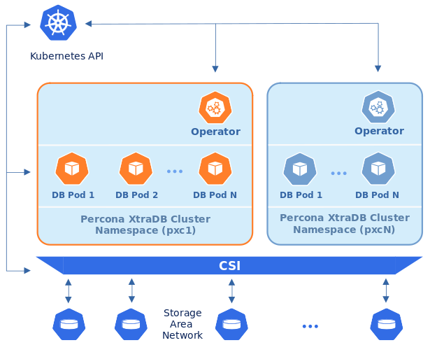
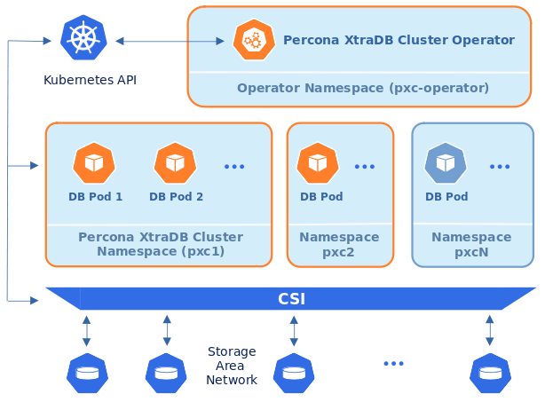

.. _install-clusterwide:

Install Percona XtraDB Cluster in multi-namespace (cluster-wide) mode
=====================================================================

By default, |pxcoperator| functions in a specific Kubernetes
namespace. You can create one during installation (like it is shown in the 
:ref:`installation instructions<install-kubernetes>`) or just use the ``default``
namespace. This approach allows several Operators to co-exist in one
Kubernetes-based environment, being separated in different namespaces:

Still, sometimes it is more convenient to have one Operator watching for
Percona XtraDB Cluster custom resources in several namespaces.

We recommend running |operator| in a traditional way,
limited to a specific namespace. But it is possible to run it in so-called
*cluster-wide* mode, one Operator watching several namespaces, if needed:

.. note:: Please take into account that if several Operators are configured to
   watch the same namespace, it is entirely unpredictable which one will get
   ownership of the Custom Resource in it, so this situation should be avoided.

To use the Operator in such *cluster-wide* mode, you should install it with a
different set of configuration YAML files, which are available in the ``deploy``
folder and have filenames with a special ``cw-`` prefix: e.g.
``deploy/cw-bundle.yaml``.

While using this cluster-wide versions of configuration files, you should set
the following information there:

* ``subjects.namespace`` option should contain the namespace which will host
  the Operator,
* ``WATCH_NAMESPACE`` key-value pair in the ``env`` section should have
  ``value`` equal to a  comma-separated list of the namespaces to be watched by
  the Operator, *and* the namespace in which the Operator resides (or just a
  blank string to make the Operator deal with *all namespaces* in a Kubernetes
  cluster).
  
  .. note:: The list of namespaces to watch is fully supported by Percona
     Distribution for MySQL Operator starting from the version 1.7. In version
     1.6 you can only use cluster-wide mode with empty ``WATCH_NAMESPACE`` key
     to watch all namespaces.

The following simple example shows how to install Operator cluster-wide on
Kubernetes.

#. First of all, clone the percona-xtradb-cluster-operator repository:

   .. code:: bash

      $ git clone -b v{{{release}}} https://github.com/percona/percona-xtradb-cluster-operator
      $ cd percona-xtradb-cluster-operator

   .. only:: comment 

      #. The next thing to do is to decide which Kubernetes namespaces the Operator
         should control and in which namespace should it reside.

#. Let's suppose that
   Operator's namespace should be the ``pxc-operator`` one. Create it as
   follows:

   .. code:: bash

      $ kubectl create namespace pxc-operator

   Namespaces to be watched by the Operator should be created in the same way if
   not exist. Let's say the Operator should watch the ``pxc`` namespace:

   .. code:: bash

      $ kubectl create namespace pxc

   .. only:: comment

      #. Edit the ``deploy/cw-bundle.yaml`` configuration file to set proper namespaces:

         .. code:: yaml

            ...
            subjects:
            - kind: ServiceAccount
              name: percona-xtradb-cluster-operator
              namespace: "pxc-operator"
            ...
            env:
                     - name: WATCH_NAMESPACE
                       value: "pxc"
            ...

#. Apply the ``deploy/cw-bundle.yaml`` file with the following command:

   .. code:: bash

      $ kubectl apply -f deploy/cw-bundle.yaml -n pxc-operator

#. After the Operator is started, Percona XtraDB Cluster can be created at any
   time by applying the ``deploy/cr.yaml`` configuration file, like in the case
   of normal installation:

   .. code:: bash

      $ kubectl apply -f deploy/cr.yaml -n pxc

   The creation process will take some time. The process is over when both
   operator and replica set Pods have reached their Running status:

   .. include:: ./assets/code/kubectl-get-pods-response.txt

#. Check connectivity to newly created cluster

   .. code:: bash

      $ kubectl run -i --rm --tty percona-client --image=percona:5.7 --restart=Never --env="POD_NAMESPACE=pxc" -- bash -il
      percona-client:/$ mysql -h cluster1-proxysql -uroot -proot_password
