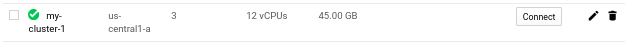
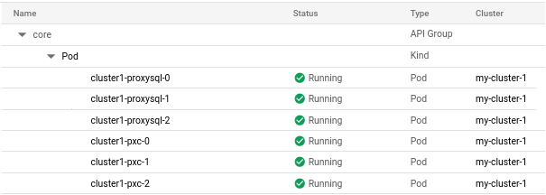

==========================================================================================
Quickstart for the Percona XtraDB Cluster Operator with the Google Kubernetes Engine (GKE)
==========================================================================================

This quickstart shows you how to configure a Percona XtraDB cluster operator with the Google Kubernetes Engine. The document assumes some experience with Google Kubernetes Engine (GKE). For more information on the GKE, see the `Kubernetes Engine Quickstart <https://cloud.google.com/kubernetes-engine/docs/quickstart>`_.

Prerequisites
=============

All commands from this quickstart can be run either in the **Google Cloud shell** or in **your local shell**.

To use *Google Cloud shell* you need nothing but a modern web browser.

If you would like to use *your local shell*, install the following:

1. `gcloud <https://cloud.google.com/sdk/docs/quickstarts>`_. This tool is the part of the Google Cloud SDK. To install it, select your operating system on the `official Google Cloud SDK documentation page <https://cloud.google.com/sdk/docs>`_ and then follow the instructions.
2. `kubectl <https://cloud.google.com/kubernetes-engine/docs/quickstart#choosing_a_shell>`_. It is the Kubernetes command-line tool you will use to manage and deploy applications. To install the tool, run the following command:

   .. code:: bash

      $ gcloud auth login
      $ gcloud components install kubectl

Configuring default settings for the cluster
============================================

You can configure the settings using the ``gcloud`` tool. You can run it either in the `Cloud Shell <https://cloud.google.com/shell/docs/quickstart>`_ or in your local shell (if you have installed Google Cloud SDK locally on the previous step). The following command will create a cluster named ``my-cluster-1``:

.. code:: bash

   $ gcloud container clusters create my-cluster-1 --project <project name> --zone us-central1-a --cluster-version 1.15 --machine-type n1-standard-4 --num-nodes=3

.. note:: You must edit the following command and other command line statements to replace the ``<project name>`` placeholder with your project name. You may also be required to edit the *zone location*, which is set to ``us-central1`` in the above example. Other parameters specify that we are creating a cluster with 3 nodes, and with machine type of 4 vCPUs and 45 GB memory.

.. |rarr|   unicode:: U+02192 .. RIGHTWARDS ARROW

You may wait a few minutes for the cluster to be generated, and then you will see it listed in the Google Cloud console (select *Kubernetes Engine* |rarr| *Clusters* in the left menu panel):

Now you should configure the command-line access to your newly created cluster to make ``kubectl`` be able to use it.

Configure kubectl commandIn the Google Cloud console, select your cluster and then click the *Connect* shown on the above image.

You will see the connect statement configures command line access. After you have edited the statement, you may run the command in your local shell:

.. code:: bash

   $ gcloud container clusters get-credentials my-cluster-1 --zone us-central1-a --project <project name>

Installing the Operator
=======================

1. You use Cloud Identity and Access Management (Cloud IAM) to control access to the cluster. The following command will give you the ability to create Roles and RoleBindings:

   .. code:: bash

      $ kubectl create clusterrolebinding cluster-admin-binding --clusterrole cluster-admin --user $(gcloud config get-value core/account)

   The return statement confirms the creation:

   .. code:: text

      clusterrolebinding.rbac.authorization.k8s.io/cluster-admin-binding created

2. Create a namespace and set the context for the namespace. The resource names must be unique within the namespace and provide a way to divide cluster resources between users spread across multiple projects.

   So create the namespace and save it in the namespace context for subsequent commands as follows (replace the ``<namespace name>`` placeholder with a descriptive name):

   .. code:: bash

      $ kubectl create namespace <namespace name>
      $ kubectl config set-context $(kubectl config current-context) --namespace=<namespace name>

   At success you will see the message that namespace/<namespace name> was created, and the context (gke_<project name>_<zone location>_<cluster name>) was modified.

3. Use the following ``git clone`` command to download the correct branch of the percona-xtradb-cluster-operator repository:

   .. code:: bash

      git clone -b release-{{{release}}} https://github.com/percona/percona-xtradb-cluster-operator

   After the repository is downloaded, change the directory to run the rest of the commands in this document:

   .. code:: bash

      cd percona-xtradb-cluster-operator

4. The ``deploy/bundle.yaml`` file contains RBAC authorizations and custom resource definistions which are extensions of the Kubernetes API. The Custom Resource Definitions for PXC adds the operator resources. So apply this file with the ``kubectl`` command as follows:

   .. code:: bash

      kubectl apply -f deploy/bundle.yaml

   The following confirmation is returned:

   .. code:: text

      customresourcedefinition.apiextensions.k8s.io/perconaxtradbclusters.pxc.percona.com created
      customresourcedefinition.apiextensions.k8s.io/perconaxtradbclusterbackups.pxc.percona.com created
      customresourcedefinition.apiextensions.k8s.io/perconaxtradbclusterrestores.pxc.percona.com created
      customresourcedefinition.apiextensions.k8s.io/perconaxtradbbackups.pxc.percona.com created
      role.rbac.authorization.k8s.io/percona-xtradb-cluster-operator created
      serviceaccount/percona-xtradb-cluster-operator created
      rolebinding.rbac.authorization.k8s.io/service-account-percona-xtradb-cluster-operator created
      deployment.apps/percona-xtradb-cluster-operator created

5. The data section of the deploy/secrets.yaml file contains base64-encoded logins and passwords for the user accounts.

   .. code:: bash

      kubectl apply -f deploy/secrets.yaml

   The return statement confirms the creation.

   .. code:: bash

      secret/my-cluster-secrets created

6. The operator has been started and the user secrets have been added, you can create the Percona XtraDB cluster.

   .. code:: bash

      kubectl apply -f deploy/cr.yaml

   The process could take some time.
   The return statement confirms the creation:

   .. code:: text

      perconaxtradbcluster.pxc.percona.com/cluster1 created

Verifying the cluster operator
==============================

The cluster may take ten minutes to get the cluster started. You  can verify its creation with the ``kubectl get pods`` command:

.. code:: text

   $ kubectl get pods
   NAME                                               READY     STATUS    RESTARTS   AGE
   cluster1-proxysql-0                                3/3     Running   0          102s
   cluster1-proxysql-1                                3/3     Running   0          77s
   cluster1-proxysql-2                                3/3     Running   0          42s
   cluster1-pxc-0                                     1/1     Running   0          103s
   cluster1-pxc-1                                     0/1     Running   0          56s
   percona-xtradb-cluster-operator-7455888c9d-wpn9j   1/1     Running   0          4m3s

Also you can see the same information when browsing Pods of your cluster in Google Cloud console via the *Object Browser*:

If all nodes are up and running, you can try to connect to the cluster with the following command:

.. code:: bash

   kubectl run -i --rm --tty percona-client --image=percona:5.7 --restart=Never -- bash -il

Executing this command will open a ``bash`` command prompt:

.. code:: text

   If you don't see a command prompt, try pressing enter.
   $

At the command prompt, you can connect to the MySQL server host.

.. code:: bash

   mysql -h cluster1-proxysql -uroot -proot_password

The return statements connects to the MySQL monitor.

.. code:: text

   mysql: [Warning] Using a password on the command line interface can be insecure.
   Welcome to the MySQL monitor.  Commands end with ; or \g.
   Your MySQL connection id is 111
   Server version: 5.5.30 (ProxySQL)

   Copyright (c) 2009-2019 Percona LLC and/or its affiliates
   Copyright (c) 2000, 2019, Oracle and/or its affiliates. All rights reserved.

   Oracle is a registered trademark of Oracle Corporation and/or its
   affiliates. Other names may be trademarks of their respective
   owners.

   Type 'help;' or '\h' for help. Type '\c' to clear the current input statement.

The following example will use the MySQL prompt to check the ``max_connections`` variable:

.. code:: bash

   mysql> SHOW VARIABLES LIKE "max_connections";

The return statement displays the current max_connections.

.. code:: text

   +-----------------+-------+
   | Variable_name   | Value |
   +-----------------+-------+
   | max_connections | 79    |
   +-----------------+-------+
   1 row in set (0.02 sec)

Troubleshooting
===============

The phrases in the ``install/secrets.yaml`` can be decoded with the following:

.. code:: bash

   $ echo -n `phrase` | base64 -D

If needed, use the ``kubectl describe`` command for the pod details.  For example, this command returns information for the selected pod:

.. code:: bash

   kubectl describe pod cluster1-pxc-0

Review the detailed information for ``Warning`` statements and then correct the configuration. An example of a warning is as follows:

.. code:: text

   Warning  FailedScheduling  68s (x4 over 2m22s)  default-scheduler  0/1 nodes are available: 1 node(s) didn't match pod affinity/anti-affinity, 1 node(s) didn't satisfy existing pods anti-affinity rules.

Removing the GKE cluster
========================

There are several ways that you can delete the cluster.

You can clean up the cluster with the ``gcloud`` command as follows:

.. code:: bash

   gcloud container clusters delete <cluster name>

The return statement requests your confirmation of the deletion. Type ``y`` to confirm.

Also you can delete your cluster via the GKE console. Just click the appropriate trashcan icon in the clusters list:

The cluster deletion may take time.
